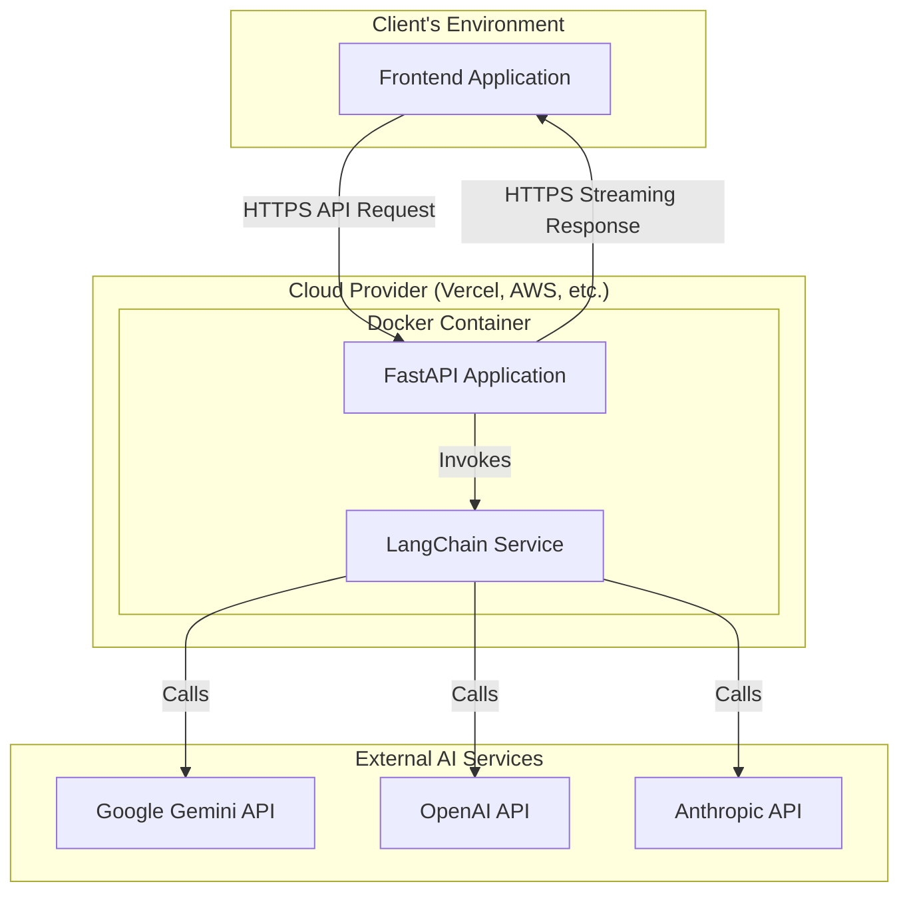

# Headless AI Chat API

A portable, model-agnostic backend service that simplifies adding powerful conversational AI features to any frontend application. Built with Python, FastAPI, and LangChain for maximum flexibility and performance.

## 🌟 Overview

This headless AI chat API solves the problem of high complexity and redundant effort involved in building and maintaining backend logic for AI-powered chat applications. It provides a single, consistent interface that abstracts away the intricacies of interacting with different AI models.

### Key Benefits

- **🔄 Model-Agnostic**: Switch between AI providers (Gemini, OpenAI, Anthropic) via simple configuration
- **🚀 High Performance**: Streaming-first API with sub-500ms TTFB after warm start
- **📦 Cloud-Agnostic**: Deploy anywhere - Vercel, AWS Lambda, Google Cloud Run, or any container platform
- **🛡️ Production-Ready**: Built-in security, error handling, and auto-generated API documentation
- **⚡ Developer-First**: Simple setup, clear documentation, and excellent DX

## 🏗️ Architecture



## 🚀 Quick Start

### Prerequisites

- **Python**: 3.11 or later
- **Poetry**: For dependency management
- **Docker & Docker Compose**: For containerization
- **AI API Key**: Gemini, OpenAI, or Anthropic API key

### Local Development Setup

1. **Clone the repository**
   ```bash
   git clone <repository-url>
   cd ai-chatbot-api
   ```

2. **Install dependencies**
   ```bash
   poetry install
   ```

3. **Set up environment variables**
   ```bash
   cp .env.example .env
   # Edit .env with your configuration
   ```

4. **Run with Docker Compose**
   ```bash
   docker-compose up --build
   ```

5. **Test the API**
   ```bash
   curl -X POST http://localhost:8000/api/v1/chat \
     -H "Content-Type: application/json" \
     -H "X-API-Key: your-api-key" \
     -d '{
       "messages": [
         {"role": "user", "content": "Hello, how are you?"}
       ]
     }'
   ```

## 📋 Environment Configuration

| Variable | Description | Required | Default |
|----------|-------------|----------|---------|
| `MODEL_PROVIDER` | AI provider (`gemini`, `openai`, `anthropic`) | Yes | `gemini` |
| `MODEL_API_KEY` | API key for the chosen provider | Yes | - |
| `API_KEY` | Static API key for endpoint protection | Yes | - |
| `ALLOWED_ORIGINS` | CORS origins (comma-separated) | No | `*` |
| `LOG_LEVEL` | Logging level (`DEBUG`, `INFO`, `WARNING`, `ERROR`) | No | `INFO` |

### Example `.env` file

```env
MODEL_PROVIDER=gemini
MODEL_API_KEY=your_gemini_api_key_here
API_KEY=your_secure_api_key_here
ALLOWED_ORIGINS=http://localhost:3000,https://yourdomain.com
LOG_LEVEL=INFO
```

## 🔌 API Reference

### Base URL
- **Local**: `http://localhost:8000`
- **Production**: `https://your-deployment-url.com`

### Authentication
All endpoints require an API key passed in the `X-API-Key` header.

### Endpoints

#### `POST /api/v1/chat`
Primary streaming chat endpoint for conversations.

**Request Headers:**
```
Content-Type: application/json
X-API-Key: your-api-key
```

**Request Body:**
```json
{
  "messages": [
    {
      "role": "system",
      "content": "You are a helpful assistant."
    },
    {
      "role": "user", 
      "content": "Hello, how are you?"
    }
  ]
}
```

**Response:**
- **Content-Type**: `text/plain` (streaming)
- **Status**: `200 OK` for successful requests
- **Body**: Streamed plain text response from the AI model

**Error Response:**
```json
{
  "detail": "Error message description"
}
```

#### `GET /api/v1/health`
Health check endpoint.

**Response:**
```json
{
  "status": "healthy",
  "timestamp": "2025-01-21T10:30:00Z"
}
```

### Message Format

Messages follow the standard chat format:

```typescript
interface Message {
  role: "system" | "user" | "assistant";
  content: string;
}

interface ChatRequest {
  messages: Message[];
}
```

## 🐳 Docker Deployment

### Build and Run Locally

```bash
# Build the image
docker build -t ai-chatbot-api .

# Run the container
docker run -p 8000:8080 \
  -e MODEL_PROVIDER=gemini \
  -e MODEL_API_KEY=your_api_key \
  -e API_KEY=your_secure_key \
  ai-chatbot-api
```

### Multi-stage Build

The included `Dockerfile` uses a multi-stage build to optimize image size and security:

1. **Builder stage**: Installs Poetry and dependencies
2. **Final stage**: Creates a minimal runtime image with only production dependencies


## 🧪 Testing

### Manual Testing with curl

```bash
# Health check
curl http://localhost:8000/api/v1/health

# Chat request
curl -X POST http://localhost:8000/api/v1/chat \
  -H "Content-Type: application/json" \
  -H "X-API-Key: your-api-key" \
  -d '{
    "messages": [
      {"role": "user", "content": "What is the capital of France?"}
    ]
  }'
```

### Using the Interactive Documentation

Once running, visit `http://localhost:8000/docs` to access the auto-generated Swagger UI documentation where you can test endpoints interactively.

## 📊 Performance & Monitoring

### Performance Targets
- **TTFB**: < 500ms after warm start
- **Availability**: 99.9% uptime target
- **Scalability**: Horizontal scaling via stateless design

### Monitoring
- Health check endpoint: `/api/v1/health`
- Structured logging with configurable levels
- Container-ready for integration with monitoring solutions

## 🔒 Security

- **HTTPS**: All communication encrypted end-to-end
- **API Key Authentication**: Static key validation via `X-API-Key` header  
- **CORS**: Configurable allowed origins
- **Container Security**: Non-root user, minimal attack surface

## 🛠️ Development

### Project Structure

```
ai-chatbot-api/
├── app/
│   ├── api/           # API routing layer
│   ├── services/      # Business logic (LangChain)
│   ├── core/          # Configuration, core objects  
│   └── main.py        # App entrypoint
├── docs/              # Documentation
├── tests/             # Test suite
├── pyproject.toml     # Poetry configuration
├── poetry.lock        # Locked dependencies
├── Dockerfile         # Container definition
└── docker-compose.yml # Local development
```

### Code Standards
- **Python**: Follow PEP 8 conventions
- **Async/Await**: All I/O operations are asynchronous
- **Type Hints**: Full type annotation coverage
- **Error Handling**: Structured error responses with proper HTTP status codes

## 🗺️ Roadmap


## 📄 License

This project is licensed under the MIT License - see the [LICENSE](LICENSE) file for details.
