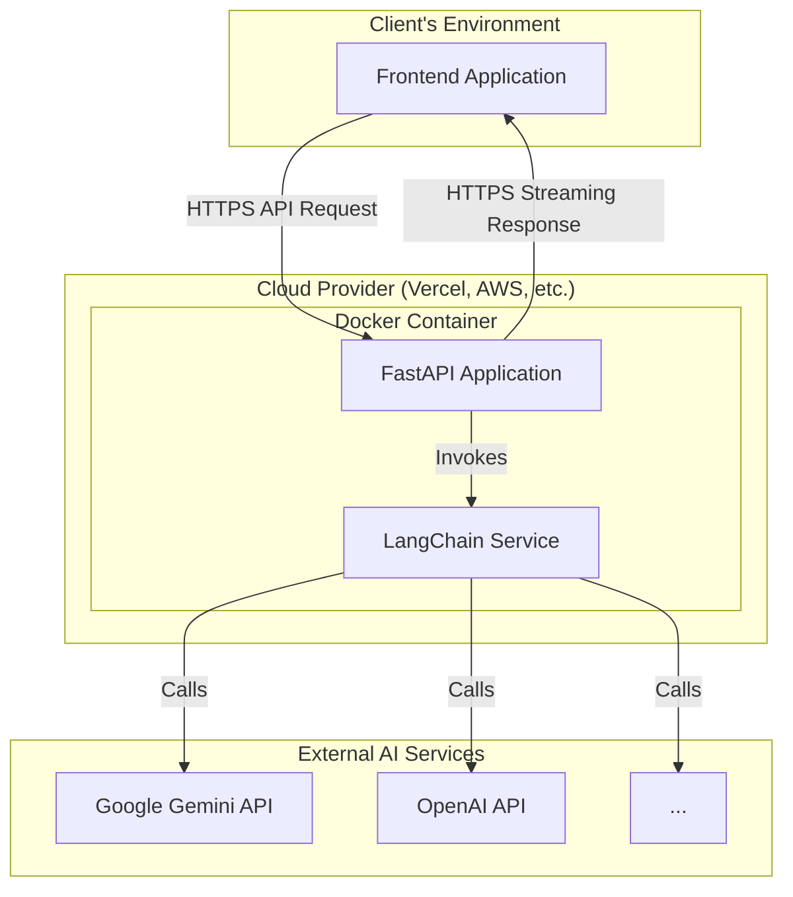
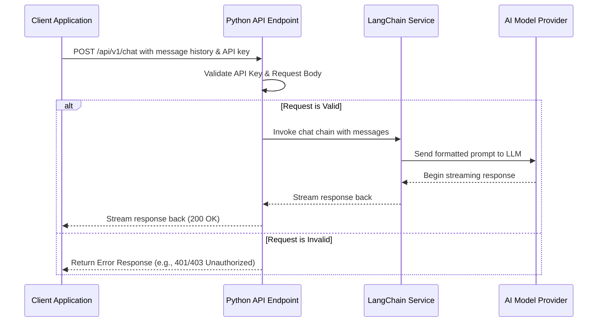

# System Architecture & Technical Specifications: Headless AI Chat API

**Author:** Lester Dela Vega
**Date:** 2025-06-21

-----

## 1\. Architectural Drivers & Decisions (The "Why")

This section covers the "why" behind the project, outlining the goals, constraints, and major design choices that shape the system.

### 1.1. Overview & Business Goals

This document describes a headless, portable AI chat API service. The primary goal is to create a reusable, model-agnostic backend that simplifies adding powerful conversational AI features to any frontend application. It solves the problem of high complexity and redundant effort involved in building and maintaining backend logic for AI-powered chat. The target user is a developer who needs a reliable API to power their user-facing chat application.

### 1.2. Key Architectural Drivers

#### Constraints

  * **Technical:** The service must be written in Python to leverage the mature `langchain.py` library and the broader AI/ML ecosystem. It must be containerized with Docker to ensure portability across different cloud environments.
  * **Budgetary:** The architecture must be deployable on platforms with generous free tiers for serverless functions or containers.
  * **Time:** The MVP must be achievable by a solo developer, emphasizing a simple, focused feature set.

#### Non-Functional Requirements (NFRs)

  * **Performance:** The API must be highly responsive. Time To First Byte (TTFB) for streamed responses should be under 500ms after a warm start.
  * **Scalability:** The architecture must be stateless and designed to scale horizontally via serverless functions or container orchestration.
  * **Availability:** Target 99.9% uptime, relying on the high availability of the underlying cloud provider's infrastructure.
  * **Security:** API endpoints must be protected. Communication must be encrypted end-to-end with HTTPS. The service will be secured using a static API key validation mechanism.

### 1.3. Core Architectural Decisions

  * **Architectural Pattern:** A **Headless API (Microservice)** pattern. The system is a standalone, backend-only service with no user interface. It is completely decoupled from any frontend client.
  * **Technology Stack:** **Python with the FastAPI framework**. This was chosen for its high performance, native asynchronous support, excellent data validation with Pydantic, and automatic API documentation generation.
  * **Data Storage:** The service is **Stateless**. For the MVP, it will not connect to a database. Conversation history is expected to be managed by the client application and sent with each API request.
  * **Deployment Strategy:** **Containerization via Docker**. This is the core decision enabling portability. A single Docker image can be deployed consistently across various platforms, including Vercel, AWS Lambda (with container image support), Google Cloud Run, and others.

-----

## 2\. High-Level System Design (The "What")

This section provides a visual overview of the system's structure and the primary data flow.

### 2.1. Architecture Diagram

This diagram shows the components of the headless system and its interactions with external services and clients.



*Diagram shows a client application making a secure API call to the FastAPI application, which is running inside a Docker container. The FastAPI app uses a LangChain service to orchestrate calls to one or more external AI model providers, then streams the response back to the client.*

### 2.2. System Workflow Example: Processing a Chat Request

This diagram illustrates the sequence of events for the API's primary function.



*Workflow demonstrates how a request from a client is validated and then passed through the service layers to an external AI provider, with the response streamed back through the same layers.*

-----

## 3\. Technology & Environment (The "With")

This section details the specific technologies used and how to set up a local development environment.

### 3.1. Development Environment Setup

  * **Python:** `v3.11` or later.
  * **Dependency Management:** **Poetry** is required for managing dependencies and virtual environments. The setup process involves running `poetry install` to create a virtual environment and install all dependencies from the `poetry.lock` file.
  * **Docker & Docker Compose:** Required for building the container and running the application locally in a consistent manner.
  * **Git:** For version control.

### 3.2. Technology Stack

| Category | Technology | Rationale & Usage Notes |
| :--- | :--- | :--- |
| **Language** | `Python` | Chosen for its unparalleled AI/ML ecosystem. |
| **Web Framework** | `FastAPI` | High-performance, async-native framework for building APIs. |
| **AI Orchestration**| `LangChain` | Core library for structuring prompts, managing chains, and interacting with LLMs. |
| **Dependency Mgt.**| **Poetry**| Provides deterministic builds and unified dependency/environment management. |
| **Data Validation** | `Pydantic` | Used for request/response validation and environment variable management. |
| **Hosting** | `Cloud Agnostic`| Deployed as a container on any supporting platform. |
| **Containerization**| `Docker` | Ensures portability and consistent deployments. |

-----

## 4\. Detailed Technical Implementation (The "How")

This section provides granular details for developers building the service.

### 4.1. Key Implementation Decisions

  * **API Design:** The API will follow RESTful principles. The primary endpoint, `POST /api/v1/chat`, will support streaming responses to provide a real-time experience.
  * **Authentication:** A static API key passed in the `X-API-Key` custom header will be used to protect the API endpoints. A FastAPI middleware will validate this key on incoming requests.
  * **Configuration:** The application will be configured entirely through environment variables (e.g., `MODEL_PROVIDER`, `OPENAI_API_KEY`, `ALLOWED_ORIGINS`). Pydantic's `BaseSettings` will be used for type-safe loading of these variables.
  * **Asynchronous Processing:** All I/O-bound operations, especially the API calls to external AI providers, will be written using Python's `async/await` syntax to ensure the service remains non-blocking and efficient.

### 4.2. Design Patterns & Coding Conventions

  * **Folder Structure:** A layered architecture will be used to separate concerns. The project root will contain `pyproject.toml` and `poetry.lock` for dependency management.
    ```
    /app
        /api    # API routing layer
        /services # Business logic (LangChain)
        /core   # Configuration, core objects
        main.py # App entrypoint
    pyproject.toml
    poetry.lock
    Dockerfile
    ```
  * **Service Layer Pattern:** Business logic is isolated in service modules (e.g., `langchain_service.py`). The API router's only job is to handle HTTP requests/responses and call the service layer.
  * **Naming Conventions:** Standard Python conventions will be used (`snake_case` for variables and functions, `PascalCase` for classes).
  * **Error Handling:** FastAPI's exception handling system will be used to catch application-specific errors and automatically convert them into structured JSON error responses with appropriate HTTP status codes.

### 4.3. Technical Constraints

  * **Statelessness:** The API must be designed to be completely stateless to function correctly in a serverless/horizontally-scaled environment. The client is responsible for maintaining conversation history.
  * **Cold Starts:** As a containerized serverless function, the API will be subject to cold starts. The Docker image size must be optimized to minimize this latency.
  * **Third-Party Constraints:** The system's performance, cost, and rate limits are ultimately constrained by the limits of the underlying AI model provider being used (e.g., Gemini, OpenAI).

### 4.4. Containerization Strategy (Docker)

To ensure portability and create an optimized production image, a multi-stage `Dockerfile` will be used. This separates build-time dependencies from runtime dependencies, resulting in a smaller and more secure final image.

```dockerfile
# 1. Builder Stage: Install dependencies
FROM python:3.11-slim as builder

# Install Poetry
RUN pip install poetry

# Set up a non-root user
RUN useradd --create-home appuser
WORKDIR /home/appuser

# Copy only the dependency files
COPY pyproject.toml poetry.lock ./

# Install only production dependencies into a virtual environment
RUN poetry config virtualenvs.in-project true && \
    poetry install --no-dev --no-root


# 2. Final Stage: Create the runtime image
FROM python:3.11-slim as final

# Set up a non-root user
RUN useradd --create-home appuser
USER appuser
WORKDIR /home/appuser

# Copy the virtual environment from the builder stage
COPY --from=builder /home/appuser/.venv ./.venv

# Copy the application code
COPY ./app ./app

# Activate the virtual environment and set the command
# This ensures that 'uvicorn' is run from within the venv
CMD ["./.venv/bin/uvicorn", "app.main:app", "--host", "0.0.0.0", "--port", "8080"]
```

-----

## 5\. Future Considerations

  * **Adopt ADRs (Architecture Decision Records):** As the project evolves, document significant architectural decisions in a dedicated `docs/adr/` directory to maintain a clear historical context for design choices.
  * **Integrate Infrastructure as Code (IaC):** For repeatable and version-controlled deployments, especially on platforms like AWS, consider using a tool like Terraform or AWS CDK to define the required infrastructure as code.
  * **Implement Distributed Tracing:** For better observability in a production environment, integrate a tracing library (e.g., OpenTelemetry) to monitor request latency across the service and its calls to external APIs.